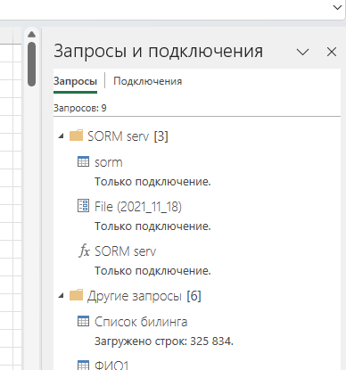
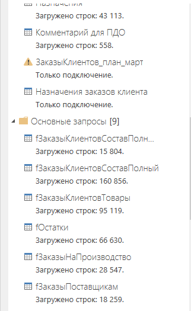
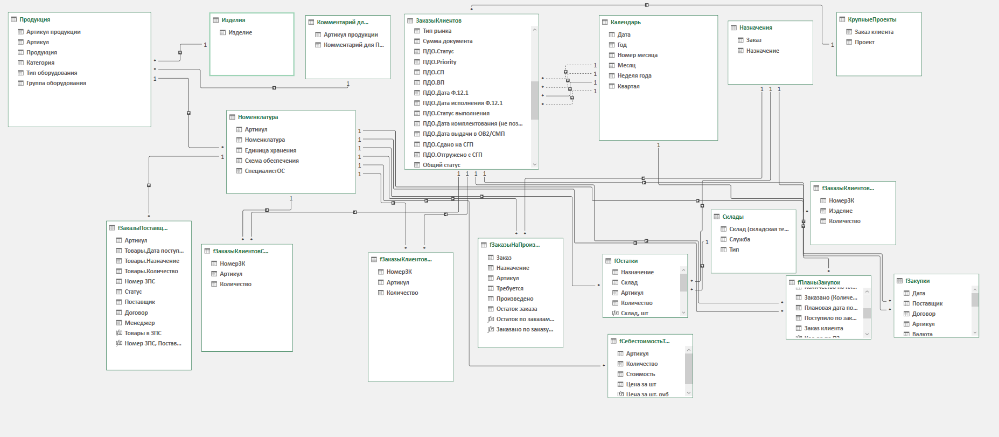
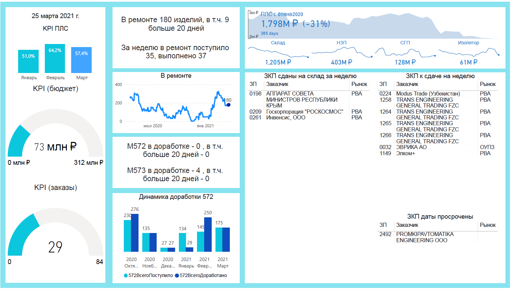
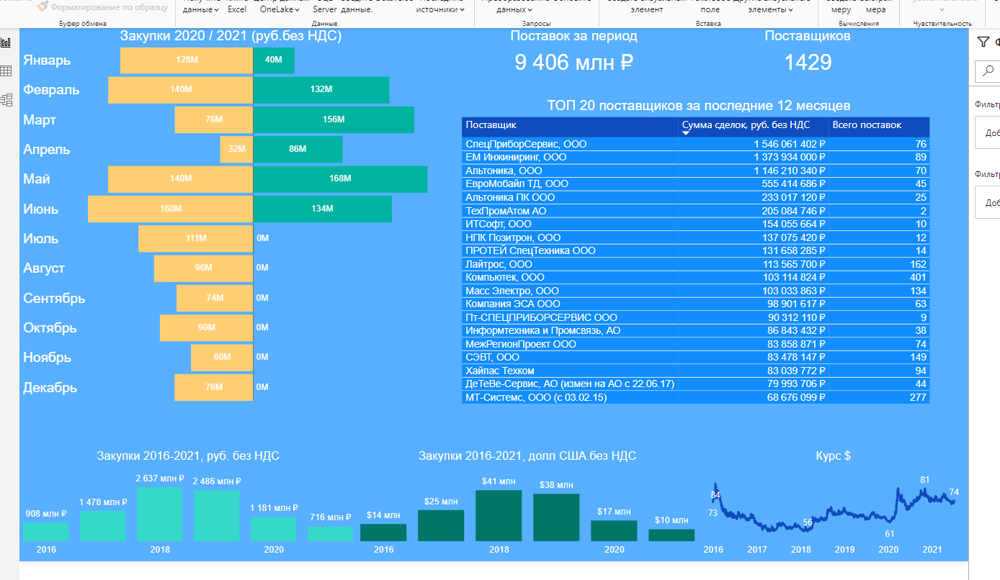

### Работа с источниками данных (Power Query)

#### CSV

* Отчеты биллинга (телефонная станция), отчет каждого дня в CVS, на момент обработки >300 тыс.строк.
* Ad-hoc задача, ГД хотел оценить как продуктивно работает нанятый call-центр. Собрал отчет в Excel с выводом в сводную таблицу топов по звонкам и пропущенным звонкам.
* Пример:



#### Excel документы (выгрузка из 1С ERP)

* Основные данные – заказы, составы заказов, остатки, движения материалов (приобретения товаров)
* Настроил выгрузку отчетов из ERP по расписанию (расширенный функционал 1C ERP + универсальный отчет), с сохранением на локальный сервер.
* Пример:



#### Excel документы (прочие)

* Документы, заполняемые пользователями – регламентные отчеты, дневные показатели (сделано-не сделано)
* Пользовательские отчеты заполняются руками, практически для каждого пришлось писать условия для обхода или исправления ошибок ввода (ввод вместо даты текста и т.д.)
* Для обработки ошибок дополнительно использовал конструкцию:

```
try … otherwise 
```

#### PostgreSQL

* Данные СКУД системы (штат сотрудников 500 человек), выгружал данные с фильтром по текущему дню.
* Использовал стандартный коннектор Power BI, объем данных небольшой, режим DirectQuery не использовал.

Помимо этого изучал основные запросы и темы:

1. DDL
2. JOINs, GROUP BY
3. VIEW
4. Оконные функции

Для обучения использовал локальную БД и pgAdmin.

#### API

* Данные по доступности или параметрам электронных компонентов со специализированных сайтов.
* Бесплатная версия одного из API ключей подразумевала не больше 30 выгрузок в минуту. Для поиска списка более чем 30 компонентов требовалось использовать несколько Excel файлов с запросами, с макросом или скриптом Power Automate с задержкой запуска следующего запроса.
* Использовал конструкцию вида:

```
let
    url = "https://api.mouser.com/api/v1/search/keyword?apiKey=(((((мой ключ)))))",
    requestBody = [
        SearchByKeywordRequest = [
            keyword = "ATMEGA328P-AU",
            records = "0",
            startingRecord = "0"
        ]
    ],
    requestBodyText = Text.FromBinary(Json.FromValue(requestBody)),
    Source = Json.Document(Web.Contents(url, [Headers = [#"Content-Type"="application/json"], Content = Text.ToBinary(requestBodyText)])),
    SearchResults = Source[SearchResults],
    Parts = SearchResults[Parts]
in
    Parts

```

Далее эту конструкцию использовал как функцию, с передачей параметра в keyword.

### Работа с моделью данных (Power Pivot)

Обычно использовал модель с таблицами-справочниками (например список продукции или номенклатуры) и таблицами-фактов (состав заказа клиента), связи использовал многие-к одному, один-к одному. Пример из одной рабочей модели (для файла производственного планирования):



### Работа с мерами (DAX)

* Для обычных показателей – SUM, SUMX, CALCULATE/FILTER/ALL для фильтрации - это 90% всех случаев. Например для МИНПРОМТОРГ надо предоставлять каждый месяц массу отчетных форм, по типам и видам продукции, для этого формировал меры вида:

```
Объем отгрузки, Гражданская, внутренний рынок, тыс.руб., прошлый месяц :=
CALCULATE (
    SUMX ( 'Выручка помесячно'; [Выручка без НДС] );
    DATEADD ( 'Календарь'[Date]; -1; MONTH );
    'Выручка помесячно'[Признак продукции] = "Да";
    'Выручка помесячно'[ВВСТ] = "Нет";
    'Выручка помесячно'[Признак экспорт] = "Нет"
) / 1000
```

* Для временных показателей – LASTNONBLANK, USERELATIONSHIP (например, в таблице заказов есть дата поступления и дата отгрузки и есть связь обоих столбцов с календарем).

* Для вывода текстовых показателей в меру – CONCATENATEX, для вывода подписей в заголовки визуализаций переменные (собрать фразу из нескольких показателей, конструкция var … return).

* Для несвязанных между собой таблиц в резких случай LOOKUPVALUE.

### Работа с макетом (отчетом Power BI)

Пример 1:

Пример2:


Пример с файлом (не с работы, отчет для рандомного интернет-магазина, файл pbix приложен)


### Облачный PBI

У нас использовались несколько аккаунтов PowerBI Pro, но в облаке практически ничего не публиковали (по соображениям безопасности).

Для обновления отчетов использвал стандартный шлюз и расписание, плюс Power Automate.

### Прочее

#### Telegram

Использовал обработку в PowerQuery для отправки коротких сообщений в телеграм чат (протокол совещания, состояние показателей), использовалась конструкция вида:

```

let 

   query =  

        let  
            KPI1 = 
                    let
                        <текст запроса>
                    in
            result

            KPI2 = 
                    let
                        <текст запроса>
                    in
            result

....

        message =    
            "KPI1: " & Text.From(KPI1) & "#(lf)" & 
            "KPI2: " & Text.From(KPI2) & "#(lf)",

        post = try Json.Document(Web.Contents(
        "https://api.telegram.org/bot(((мойключик)))/sendMessage", [Query = [chat_id="(id канала)",text=message],  Content = Text.ToBinary(message)]))[ok] 
     otherwise false

    in post, 

   tab = #table(1, {{query}}) 

in tab


```

Соответственно в PBI обновление отчета было поставлено на расписание - каждое утром в канал к ТОПам приходило сообщение о состоянии основных показателей.

#### Power Automate Desktop

Использовал для каких-то повторяющихся или рутинных задач, или Ad-hoc задач.

Одна из последних - обработать массив из примерно 300 документов Excel, в каждом от 5 до 15 вкладок - заменить ФИО начальника отдела на новую (документы изготовили до смены начальника сметно-экономического отдела)
Решил через обработку вида (два цикла, цикл по всем файлам и цикл по всем вкладкам выбранного файла):

```
Folder.GetFiles Folder: $'''\\\\Rackstation\\communication2\\СЭО\\2_ГОЗ_2022\\Ремонты\\ФСБ\\43753\\3этап\\Производство без заказа 0С00-000446\\РКМ\\МатериалыИРаботы - 346шт''' FileFilter: $'''*''' IncludeSubfolders: False FailOnAccessDenied: True SortBy1: Folder.SortBy.NoSort SortDescending1: False SortBy2: Folder.SortBy.NoSort SortDescending2: False SortBy3: Folder.SortBy.NoSort SortDescending3: False Files=> Files
LOOP FOREACH CurrentItem2 IN Files
    Excel.LaunchExcel.LaunchAndOpenUnderExistingProcess Path: CurrentItem2 Visible: True ReadOnly: False Instance=> ExcelInstance
    Excel.GetAllWorksheets Instance: ExcelInstance Worksheets=> SheetNames
    LOOP FOREACH CurrentItem IN SheetNames
        Excel.SetActiveWorksheet.ActivateWorksheetByName Instance: ExcelInstance Name: CurrentItem
        Excel.FindAndReplace.FindAndReplaceSingle Instance: ExcelInstance TextToFind: $'''Мартемьянов А. В.''' TextToReplaceWith: $'''Горбачева О. Ф.''' MatchCase: False MatchEntireCellContents: False SearchBy: Excel.SearchOrder.Rows FoundColumnIndex=> FoundColumnIndex FoundRowIndex=> FoundRowIndex
    END
    Excel.CloseExcel.CloseAndSave Instance: ExcelInstance
END


```

Пример того, как это работает:

<video src="video_2023-10-12_13-19-22.mp4" controls title="Title"></video>
